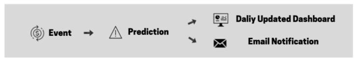

# Supervised Anomaly Detection & Real Time Notification Using Amazon Sagemaker, AWS Kinesis, AWS SNS and AWS Quicksight

2019 MSBA 6330 / MSBA 6320 Trends Marketplace

Group members: Zheming Lian, Jiahui Jiang, Shunshun Miao, Pahal Patangia, Fazel Tabassum, Chuchen Xiong

## Project Description

Anomaly detection is a technique used to identify rare items, events, or observations which raise suspicion by differing significantly from most of the data you are analyzing. There are a wide range of applications in different industries including abnormal purchases in retail, cyber intrusions in banking, fraudulent claims in insurance, unusual machine behavior in manufacturing, and even detecting strange patterns in network traffic that could signal an intrusion. Leveraging a solution provided by [aws](https://s3.amazonaws.com/solutions-reference/fraud-detection-using-machine-learning/latest/fraud-detection-using-machine-learning.pdf), we developed an end-to-end anomaly detection workflow starting from data streaming to dashboarding. 

## Guideline

To take a deep look at how we built up this workflow, please check out **User Guide.md**

To take a quick look at our project, please check out **handout.pdf**

## Details in our workflow 
On a high level, We fit a classification model with historical fraud data and deployed it to a service endpoint. When the streaming data comes in, such endpoint will be invoked and make real time prediction. A notification would be sent out if an anomaly is detected by the algorithm. At the end of each day, a summary dashboard would be automatically updated to reflect the recent pattern of anomal activities, providing insights to stackholder. 

## Dataset 
In this project, we used a credit card fraud dataset from [Kaggle](https://www.kaggle.com/mlg-ulb/creditcardfraud) as a demo to demonstrate our solution. The dataset contains 30 variables, among which 28 are principle components obtained with PCA, the only variables which have not been transformed with PCA are 'Time','Amount' and 'Class'. The dataset is highly unbalanced, the positive class (frauds) account for 0.172% of all transactions. Therefore, we resampled the dataset to make the ratio of fraud to non-fraud became 1:100.

## Files

Most files are added a prefix that corresponds to the step it involved of our **user guide**.

**User Guide.md**

a detailed walk through of our project

**creditcard_sample.csv**

a sample of dataset that was used in this project.

**fraud-detection-using-machine-learning.template**

Set up the configuration in CloudFormation

**Handout.pdf**

The flyer we used in the presentation section.

**Voicethread.mov**

The slides and presentation

**step2_training_sagemaker_logistic.ipynb**

Train a logistic model and deploy it to an sagemaker endpoint.

**step3_fraud_func.py**

Perform data preprocessing, prediciton, and post processing task. 

**step3_fraud_send_alert.py**

Invoke a SNS client and sent a message to the designated endpoint.

**step5_streaming_resample.ipynb**

Prepare the steaming data for real time predictiction

**step7_filter_fraud_output.sql**

Subset data that has assigned a fraud label by our model

**step9_manifest.json**

config Quicksight dashboard.
