# User Guide
## General reminder:
* Please note that you are responsible for the cost of the AWS services used while running this solution. See the Cost section for more details. For full details, see the pricing webpage for each AWS service you will be using in this solution. 
* We attached the AdministratorAccess Policy to an IAM role when it is necessary. In most real world scenarios this is not an appropriate practice. If you have certain concern, please set up the corresponding IAM role at your discretion. For further reference, please visit this [guideline](https://docs.aws.amazon.com/IAM/latest/UserGuide/best-practices.html)

## Step 0: set up AWS account, boto3, authentication credentials. 
* **If you doesn’t have an AWS account yet**: please go to [this website]([Amazon Web Services (AWS) -  Cloud Computing Services](https://aws.amazon.com/?nc1=h_ls)), click the button on the upright corner to create a new AWS account. 
[](img/create_account.png)
* **If you doesn’t know what is boto3, or doesn’t configure authentication credential for boto3 yet**: please go through this [tutorial](https://boto3.amazonaws.com/v1/documentation/api/latest/guide/quickstart.html) and set up boto3 accordingly.
* **If your aws account is subscribing the [free tier](https://aws.amazon.com/free/free-tier-faqs/) price plan**: you may need to request an increase in quota for a more powerful instance (ml.c4.xlarge in this case).
	* please follow this [guideline](https://docs.aws.amazon.com/general/latest/gr/aws_service_limits.html) to request a quota increase. 
## Step 1: Launch the Stack
Use this [AWS CloudFormation template](https://s3.amazonaws.com/solutions-reference/fraud-detection-using-machine-learning/latest/fraud-detection-using-machine-learning.template) to deploy a sample solution provided by the aws. For the detail, please refer to the step 1 of this [tutorial](https://s3.amazonaws.com/solutions-reference/fraud-detection-using-machine-learning/latest/fraud-detection-using-machine-learning.pdf).
## Step 2: Run the sagemaker notebook. 
For the scope of this project,  we made a tradeoff between model performance and low latency: Although xgboost algorithm provides better performance, its high latency is unacceptable for the end user who are limited by budget and couldn’t deploy a powerful instance. In this case, logistic regression is a reasonable alternative.

If you need a solution that avoids a high latency while keeping reasonable performance, please use **sagemaker_logistic.ipynb** in this repository. This notebook is an updated version of the one provided by original template.

(If your priority is model performance and is ok with relatively high latency, please contact us, we will provide a tailored solution to you. )

Instruction for Step 2:

* Navigate to **Amazon S3** console and create following buckets: **fraud-model-data** and **fraud-result**.
* Navigate to the **Amazon Sagemaker console**. 
* On the left side of console, click on **notebook instance**, then click on **FraudDetectionNotebookInstance**, then click on **Open Jupyter**, this will open a new tab for jupiter notebook
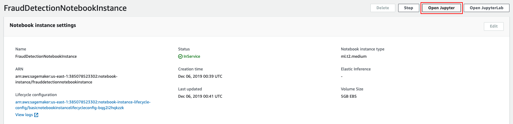
* Upload the **step2_sagemaker_logistic.ipynb** to this notebook.

* Run every code cell until **Incremental training** section.

At this point, a logistic model is trained by top 80% of dataset and is deployed to a sagemaker endpoint named **fraud-detection-endpoint**
## Step 3: set up Lambda Function:
Broadly speaking, Lambda function is responsible for processing incoming data.

Instruction:

* Open Lambda console, go to the **function** tab, and click on **Create function** on the top
* Choose Author from scratch, denote **fraud-func** as the **function name**, choose **Python 3.6** as the **Runtime**, then click **create the function**
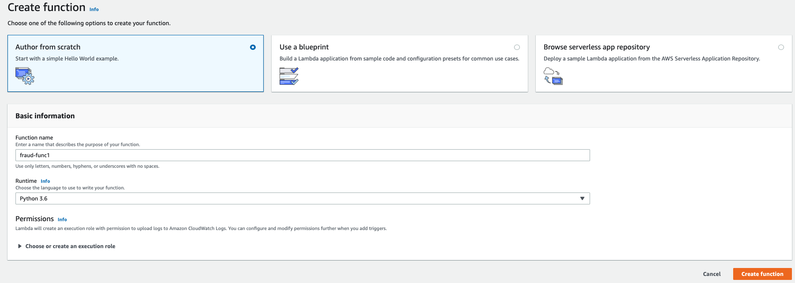

* Navigate to the **function** tab, click on **fraud-func**, and then go to the **configuration** tab. put the code of **step3_fraud_func.py** in this repository into the console under the **Function code** section. This python script is built upon the original lambda function provided by aws.
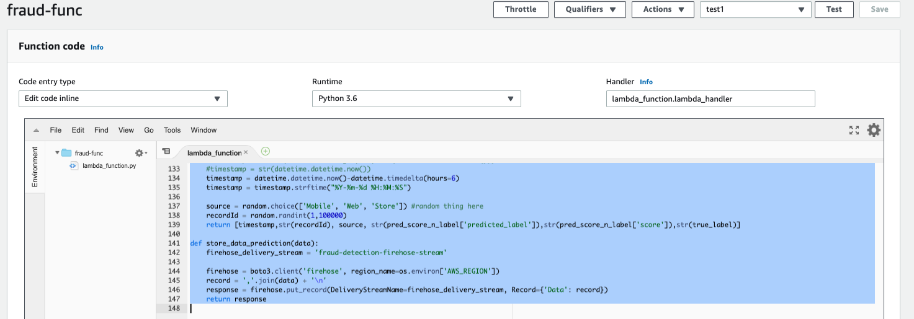

* Go to execution role section, view the existing role that assigned by the template, view this role on the IAM console, attach the administratorAccess policy to it. 

Repeat the steps above for **step3_fraud_send_alert.py**, used **fraud-send-alert** as the name of certain lambda function. (don’t forget to attach administratorAccess policy to the corresponding IAM role)

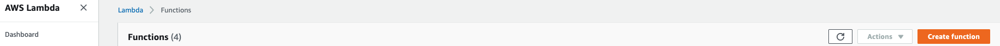


## Step 4: set up Kinesis Firehose Stream
This Kinesis Firehose Stream will receive the incoming data and trigger certain lambda function to process the data. 

Instruction:

* Create a Kinesis Firehose Stream from the Kinesis console, on step 1,  denote the name as **data-for-fraud-detection**, choose **Direct PUT or other sources** as data source.
* Navigate to step 2, enable data transformation, and select **fraud-func** as your lambda function.
* Navigate to step 3, select Amazon S3 as destination, and specify **fraud-result** as S3 bucket.
* Navigate step 4, set Buffer size under **S3 buffer conditions** section as 1MB, and set buffer interval as 60 seconds.
* Use default setting for all other config.
* Review the setting on step 5 and create the stream. 

## Step 5: prepare live data
Please make sure that you have already set up boto3 (see step 0) before running the following notebook. 

* Upload the **step5_streaming_resample.ipynb** to the jupyter notebook on your local, open this notebook and run the code until **start streaming** section (last section).
* Read the documentation of function **init()** of class **KinesisLoader**, try to understand the parameters.
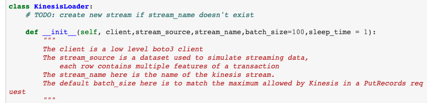

## Step 6: set up SNS topic

* go to SNS console, create a SNS topic with topic name **fraud-send-alert**. 
* Create a subscription for **fraud-send-alert** topic and select the email as protocol, type your email address as endpoint. 
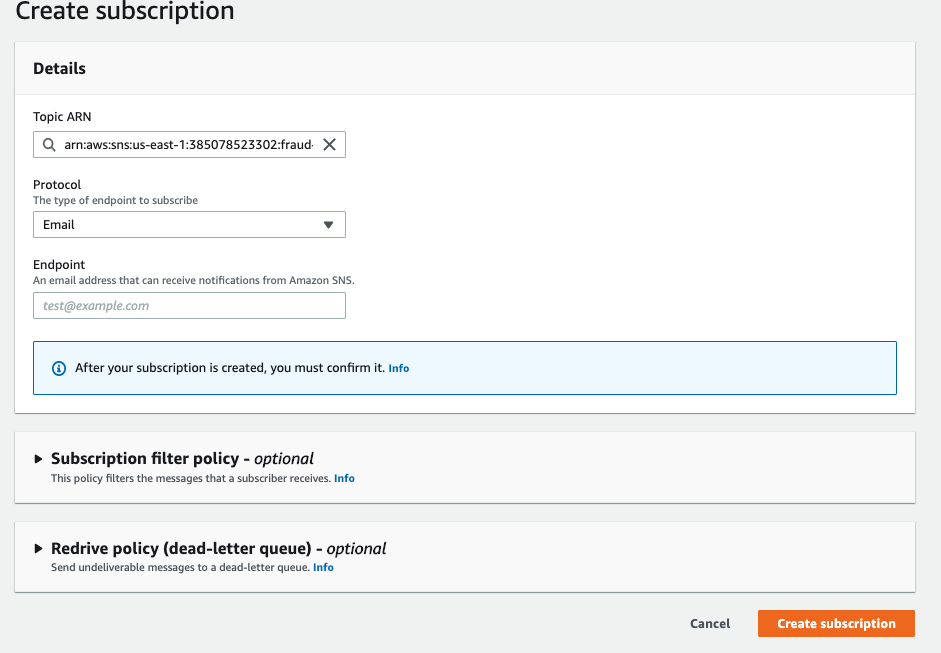

## Step 6.1 modify lambda function
* Navigate to **SNS** console, select **fraud-alert** topic. 
* Copy the **ARN** of this topic.

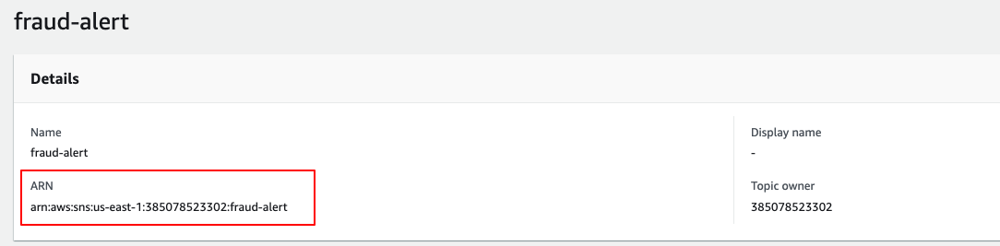

* Navigate to the **Lambda** console, open the code console of **fraud-send-alert** lambda function, and replace the topic_arn with the the one that you just copied in the last step.
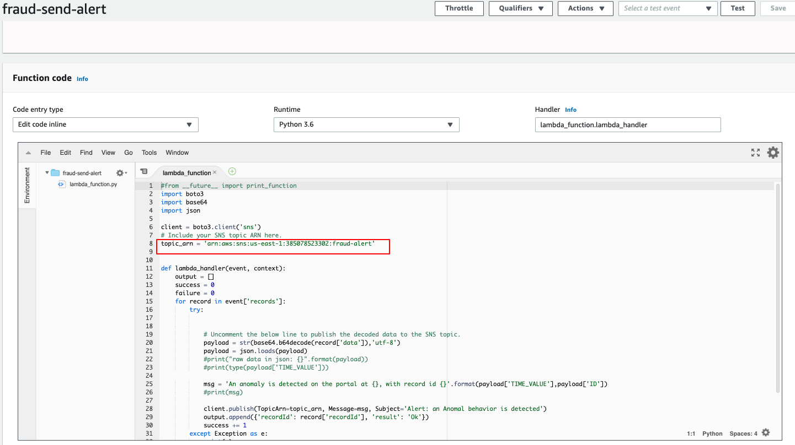
* Save the lambda function.

## Step 7: set up kinesis data analytic
Kinesis data analytic is used for setting up a dynamic stream based on incoming data and then perform query on this dynamic stream.

Instruction:
* Create a Kinesis Analytics application with name **fraud-filter-alert**, use SQL as **runtime**.
* Once the application is created, click **connect streaming data** under source section. choose Kinesis firehose delivery stream as Source, and select **fraud-detection-firehose-stream** as the data source.
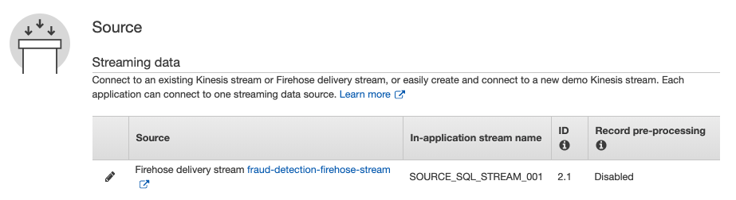
* Go to the **step5_streaming_resample.ipynb**. Under the **start the stream** section , set up a stream with small sample of data (~200 rows) at a relatively slow rate (~2 record/sec). 

```
#an example

upload_client = KinesisLoader(client,test_card_final.iloc[:200,:],'data-for-fraud-detection',batch_size=1,sleep_time=0.5)

upload_client.submit_batch()
```
* Go back to the set up page of kinesis data analytic, at the bottom of page, click discover schema, wait a few seconds before the application detects the data stream. 
* Click on **edit schema**, and replace both dummy column name (COL0, COL1, etc) and inferred data types with the following:
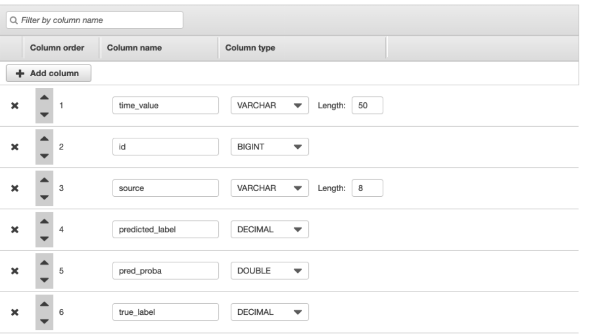

* Click **Save and Continue**, and go to real time analytic section, put codes in **step7_filter_fraud_output.sql** to the console, click **save and run SQL**
* Go to the Destination section of the main page of **fraud-filter-alert** application, click **connect new destination**, select **AWS lambda function** as your destination and specify  **fraud-send-alert** as your lambda function. 
* Under **In-application stream** section, specify **DESTINATION_SQL_STREAM** as your in-application stream, remain others as default setting, and then click **save and continue**.

The result Destination setting is supposed to be similar as the following screenshot
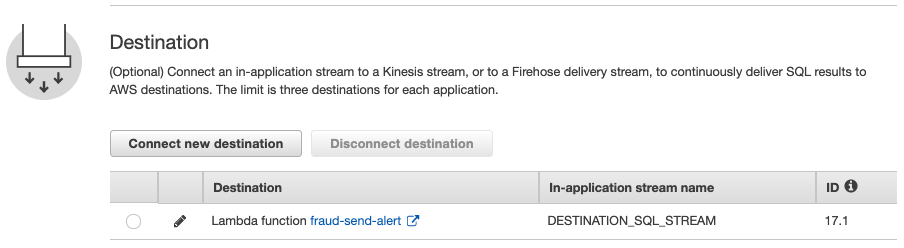


## Step 8: running the stream
At this point, most component of the workflow is set up. 

* Run the **start the stream** section of **sagemaker_logistic.ipynb** to initiate a stream. Before do so you can change the parameter to customize the stream. (see Step 5). 
* Alternatively, use a while loop to keep the stream running. You can stop the stream by **interrupting the kernel** of certain jupyter notebook.

## Step 9: initiate the summary dashboard hosted by Quicksight
a dashboard is supposed to be built after a reasonable number (> 1000)  of data come in. So wait for a while before you start this step. 

* Download **step9_manifest.json** from this repository and modify the URIPrefixes URL.
	* Modify the region name to match the region where you deployed the solution, if necessary.
	* Modify the Amazon S3 bucket name to match the name you specified for **Results Bucket Name** AWS CloudFormation template parameter during deployment.
* Navigate to the Amazon QuickSight console.
* Select **Manage Data**.
* Select **New data set**.
* Select **S3**.
* For **Data source name**, enter a name. For example, fraud_detection_events.
* For **Upload a manifest file**, select the **Upload** radio button and click the folder icon. Navigate to the “manifest.json” file you saved earlier.
* Select **Connect**.
After a few minutes, a success message should appear that shows that the S3 data imported into the Amazon QuickSight in-memory calculation engine (SPICE). SPICE acts as a cache for the data stored in your data source. 
* When the **Finish data set creation** window appears, select **Edit/Preview data**.
* On the Edit page, change the column headers to more meaningful names. For example, Timestamp, ID, Source, and Fraud.
* Select **Save & Visualize**

The dashboard is supposed to be set up at this point:

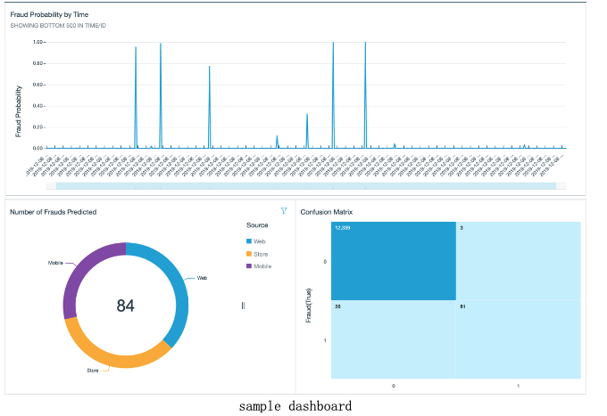
* To refresh your input data automatically, see  [Refreshing Data](https://docs.aws.amazon.com/quicksight/latest/user/refreshing-imported-data.html)  in the Amazon QuickSight User Guide.


